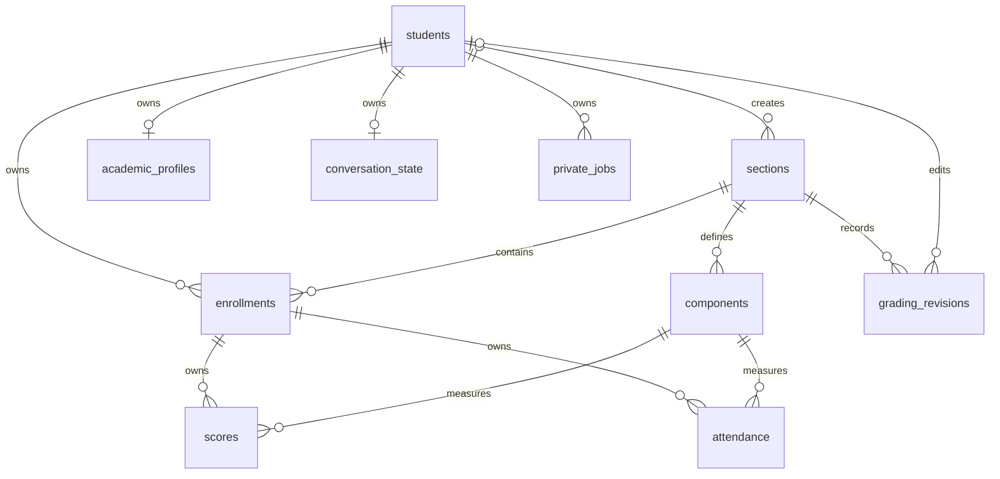

# Current lifecycle schema, migration 003

The existing drawio/PNG contain earlier user edits. This diagram documents the new relationships without replacing those files.

Private student references use ON DELETE CASCADE, including enrolments and their scores/attendance. Section creator and revision actor references use ON DELETE SET NULL. Section structures and classmates remain after deletion; ownership is not transferred. Every score/attendance reference pairs its enrolment/component ID with the same section ID.

Migration 003 also adds enrolment creation time for stable pagination and a positive structure revision. Legacy creators remain null. Weight-update endpoints will use revision history in the next implementation stage.

Conversation/job storage exists to establish deletion linkage. No chat processor, scheduler or OCR service is enabled by this migration. Each future processor must recheck consent and original student/job identity immediately before its transaction writes.
